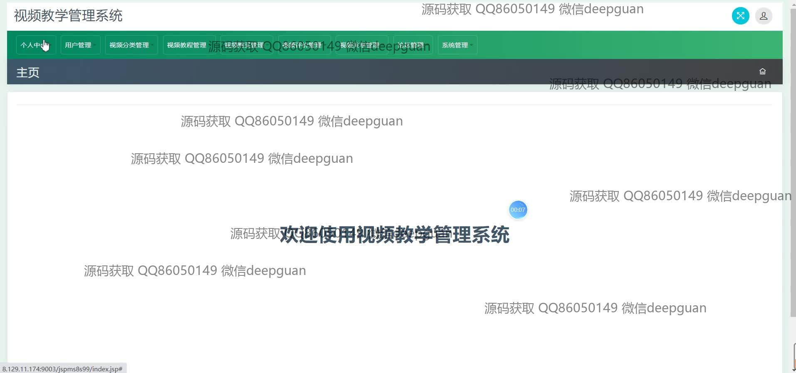
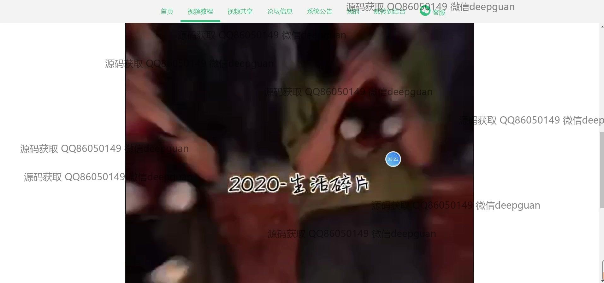
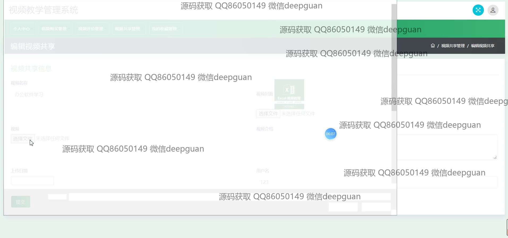

<h1 align="center">的课程教学视频共享购买系统</h1>

## 简介
课程教学视频共享购买系统：角色分为管理员、用户；支持视频教程管理、购买与共享，论坛信息交流，用户评价反馈，订单信息管理及个性化用户中心。    --计算机毕业设计源码；毕设源码；java毕业设计源码

## 联系方式

<h3 align="center">获取完整代码与数据库文件 + 微信：deepguan QQ: 86050149 QQ群: 783742310</h3>

<h3 align="center">可帮忙远程部署 包运行成功！提供远程部署、修改代码、设计文档指导、代码讲解等服务！</h3>

## 功能介绍（完整见运行截图）
管理员：提供管理接口，包括用户管理、视频管理、分类管理以及公告发布。具备视频上传和编辑功能，可添加视频详细信息如编号、名称、分类、封面和简介。能查看和管理订单信息，支持系统公告的编辑和发布，维护平台运行和资源更新。可进行论坛管理，审核用户评价和反馈以优化平台服务。

用户：可通过界面进行注册、登录和个人信息管理，包括编辑资料和修改密码。用户中心提供我的发布和收藏功能，便于管理个人资源和偏好。用户能浏览和购买视频课程，参与视频共享和评价，反馈课程质量和改进建议。论坛功能支持用户提问和交流，实现对教学资源的互动分享与学习交流。

操作员：负责录入订单信息和维护视频课程的购买记录，确保交易的准确性和完整性。可以协助管理员进行视频内容的编辑和上传，对视频价格和发布日期信息进行维护。管理客户服务消息及反馈，提升用户满意度，通过平台公告和系统消息发布维护信息。

游客：可访问平台首页及浏览公开的视频教学资源与介绍，查看论坛信息和公告动态。可以通过客服系统进行初步咨询与了解，参与公开的论坛讨论，与注册用户交流以获取更多学习资源与建议。

## 运行截图

本代码来源于网络,仅供学习参考使用!

